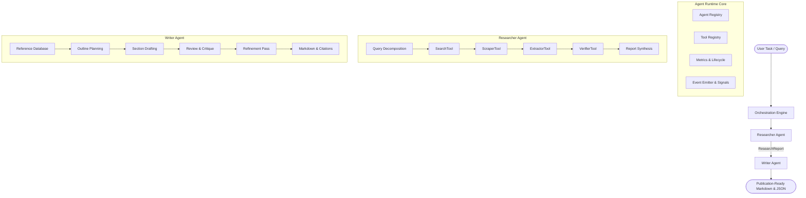

# Multi-Agent AI System Architecture Specification

## 1. Executive Summary

This architecture defines an enterprise-grade, extensible, and fully-typed autonomous multi-agent AI system developed in TypeScript. The system provides production-ready orchestration for specialized AI agents—specifically a multi-vector **Researcher Agent** and a publication-quality **Writer Agent**—operating over a decoupled runtime featuring tool execution registries, lifecycle management, event streaming, metrics instrumentation, and LLM abstraction layers.



---

## 2. Core Runtime Architecture (`src/core/`)

### 2.1 Agent Lifecycle & BaseAgent (`BaseAgent<TInput, TOutput>`)
All agents inherit from `BaseAgent`, which standardizes:
- **State Lifecycle**: Managed transitions across `idle` -> `initializing` -> `running` -> `completed` / `failed` / `paused`.
- **Event Streaming**: Emits typed lifecycle events (`status_change`, `step_start`, `step_end`, `tool_start`, `tool_end`, `thought`, `message`, `error`).
- **Telemetry & Metrics**: Continuous tracking of execution time (`totalExecutionTimeMs`), token consumption (`totalTokensUsed`), step count, tool call count, and LLM completions.
- **Cancellation & Timeout**: Native integration with `AbortSignal` and configurable execution timeouts, ensuring graceful shutdown without resource leakage.

### 2.2 Tooling Abstraction & Registry (`BaseTool`, `ToolRegistry`)
- `BaseTool<TInput, TOutput>` enforces strict input validation, exception containment, execution timing, and OpenAI-compatible JSON schemas (`ToolDefinition`).
- `ToolRegistry` provides centralized discovery, registration, duplicate detection, schema exposure, and sandboxed tool execution.

### 2.3 Agent Registry (`AgentRegistry`)
- Thread-safe in-memory registry allowing dynamic lookup by unique ID or human-readable agent name.

---

## 3. LLM Abstraction Layer (`src/llm/`)

- `ILanguageModel`: Clean interface decoupling prompt orchestration from specific model vendors (Gemini, OpenAI, Anthropic, local weights).
- `MockLanguageModel`: High-fidelity simulation engine supporting:
  - Deterministic canned strings and structured JSON outputs.
  - Pattern-matching response handlers.
  - FIFO response queues (`queueResponse`).
  - Character-based token estimation and call history inspection.

---

## 4. Autonomous Researcher Subsystem (`src/agents/researcher/`)

The Researcher agent operates as a multi-stage autonomous pipeline designed to discover, extract, verify, and synthesize knowledge from diverse information sources.

### 4.1 Pipeline Phases
1. **Query Decomposition & Aspect Planning**:
   - Deconstructs high-level topics into multi-angle search queries across architectural, performance, reliability, and market dimensions.
   - Adapts query volume to requested depth: `quick` (1 round), `standard` (2 rounds), or `deep` (3+ rounds).
2. **Multi-Source Retrieval (`SearchTool`)**:
   - Executes targeted queries against knowledge stores with domain whitelisting and blacklisting.
3. **Deep Content Extraction (`ScraperTool` + `ExtractorTool`)**:
   - Cleans HTML markup, normalizes content, and extracts structured facts (`ExtractedFact[]`) containing confidence scores, entity classifications, statistics, and verifiable quote snippets.
4. **Source Verification & Credibility Analysis (`VerifierTool`)**:
   - Computes domain authority scores based on TLDs and institutional reputation (.edu, .gov, peer-reviewed journals vs. user blogs).
   - Segregates facts into `verifiedFacts` and `unverifiedFacts` based on weighted credibility thresholds.
5. **Report Synthesis**:
   - Compiles executive summaries, findings grouped by aspect, key takeaways, research limitations, and execution metadata into a structured `ResearchReport`.

---

## 5. Autonomous Writer Subsystem (`src/agents/writer/`)

The Writer agent transforms research findings, briefs, and guidelines into publication-grade technical documents and reports.

### 5.1 Pipeline Phases
1. **Reference Indexing & Citation Management**:
   - Builds reference registries mapping source URLs, titles, and domains to citation markers.
   - Formats citations across multiple styles: `numbered` (`[1]`), `footnote` (`[^1]`), `inline` (`(domain)`), or `author_date` (`(Author, 2024)`).
2. **Outline Planning (`ContentOutline`)**:
   - Dynamically constructs structured sections with word count allocations, required key points, and citation assignments.
3. **Section-by-Section Drafting**:
   - Synthesizes prose tailored to the requested audience (`general`, `technical`, `executive`, `academic`, `casual`) and tone (`authoritative`, `conversational`, `objective`, `persuasive`, `educational`).
4. **Automated Review & Critique (`ReviewFeedback`)**:
   - Evaluates readability, coherence, tone alignment, and factual grounding with section-level critique metrics.
5. **Iterative Refinement Loop**:
   - Automatically executes targeted revision passes for sections identified as requiring editorial enhancement.
6. **Document Assembly**:
   - Compiles full Markdown output complete with header hierarchies and an appended bibliographic references section.

---

## 6. End-to-End Multi-Agent Collaboration

The system enables composition where the `ResearchReport` generated by `ResearcherAgent` directly feeds into `WriterAgent` via `WritingBrief.researchReport`.

```
[User Request]
      │
      ▼
ResearcherAgent.execute({ topic, depth: 'standard' })
      │
      ▼ (ResearchReport)
WriterAgent.execute({ topic, researchReport, format: 'report', citationStyle: 'numbered' })
      │
      ▼ (WriterResult)
[Publication-Ready Markdown & Structured Draft]
```

---

## 7. Quality Assurance & Test Strategy

- **100% Type-Safe**: Strict TypeScript compilation with zero type assertions bypasses.
- **High Coverage**: Comprehensive unit and integration test coverage across all tools, agents, registries, and utilities using `vitest`.
- **Fault Tolerance**: Resilient error boundaries, input validators, fallback synthesizers, and abort signal checks at every execution step.
